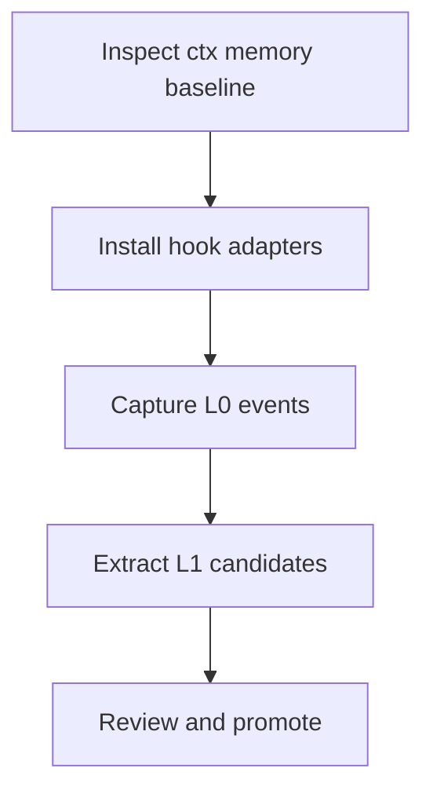

# Layered Memory System Spec

Status: Draft

## Desired Outcome

`ctx` should become the local memory engine for coding agents. After explicit
hook installation, it should capture agent sessions, retain drill-down evidence,
extract reviewable memories, consolidate stable context, and inject useful
recall into Codex and Claude Code without requiring a cloud service.

The target behavior is a Rust-native version of TencentDB-Agent-Memory's useful
parts:

- L0 raw conversation and tool-event journal.
- L1 structured memory extraction plus conflict detection.
- L2 scene briefs grouped by durable themes.
- L3 persona/profile distilled from changed scenes.
- Short-term tool-output offload and Mermaid active task graph.
- Host adapters for Codex and Claude Code hooks.

## Current ctx Baseline

Existing `ctx` pieces to preserve and extend:

- `src/storage.rs` owns SQLite setup, FTS5 tables, and indexing.
- `src/memory.rs` owns explicit scoped memories and hybrid lexical/vector
  recall.
- `src/embeddings.rs` provides a local FastEmbed boundary with an off switch.
- `src/agents.rs` generates project `AGENTS.md` instructions.
- `docs/architecture.md` documents the current resource/memory split.

The memory work should extend these modules rather than add an unrelated
runtime.

## Reference Behavior To Port

From TencentDB-Agent-Memory:

- `TdaiCore` is host-neutral and separates host adapters from memory logic.
- L0 records raw conversation messages and keeps extraction source ids.
- L1 uses an LLM to extract scene-segmented memories with type, priority,
  source ids, scene name, and metadata.
- L1 dedup recalls vector/FTS candidates, then asks an LLM to store, update,
  merge, or skip.
- L2 writes scene Markdown with backups and an index.
- L3 writes a persona/profile from changed scenes.
- Recall separates dynamic L1 hits from stable scene/persona/tool guidance.
- Offload records tool pairs, stores bulky outputs, injects an active Mermaid
  task graph, and exposes node ids for drill-down.

Do not port the current gateway omission where `/recall` drops dynamic L1
`prependContext`.

## Control Surfaces

- Source: Rust modules, schemas, CLI commands, tests, generated instructions.
- Storage: SQLite, FTS5, embedding blobs, content-addressed payload files.
- Runtime: direct CLI hooks first, optional local `ctx daemon` for local
  bookkeeping and job coordination.
- Hooks: Codex and Claude Code lifecycle events.
- Agent harness: Codex, Claude Code, or another installed harness runs L1/L2/L3
  reasoning with its existing model/tool configuration.
- Agent instructions: generated `AGENTS.md` plus hook-injected context.
- Validation: Rust unit tests, CLI integration tests, hook fixtures, and recall
  quality benchmarks.

## Architecture

```text
Codex/Claude hooks
        |
        v
ctx hook ingest / ctx hook recall
        |
        v
event normalizer + redactor
        |
        v
L0 journal + blob store  ->  offload graph + node drill-down
        |
        v
memory jobs
        |
        +--> L1 extraction + dedup -> review queue -> active memories
        |
        +--> L2 scene briefs
        |
        +--> L3 persona/profile
        |
        v
recall packer -> hook additional context + AGENTS.md drill-down commands
```

## Proposed Modules

- `src/hooks.rs`: hook installer, hook config rendering, hook event dispatch.
- `src/hook_events.rs`: normalized Codex/Claude event schema and JSON stdin
  parsing.
- `src/journal.rs`: L0 sessions, messages, tool events, and payload blobs.
- `src/memory_layers/l1.rs`: extraction, dedup, promotion, and review queue.
- `src/memory_layers/l2.rs`: scene grouping and Markdown materialization.
- `src/memory_layers/l3.rs`: persona/profile synthesis.
- `src/offload.rs`: offload nodes, task graph, Mermaid rendering, drill-down.
- `src/harness_jobs.rs`: job prompts, expected JSON schemas, result ingestion,
  and harness-facing commands.
- `src/redaction.rs`: shared sanitization before storing or injecting text.
- `src/jobs.rs`: lightweight local job queue for extraction/synthesis tasks.

The first implementation can keep these as flat files if that matches the
existing small-module style; the boundaries matter more than the folder shape.

## Storage Model

SQLite remains canonical.

Add tables:

- `agent_sessions`: host, project root, thread/session ids, started/ended time.
- `hook_events`: normalized lifecycle events with redaction metadata.
- `conversation_messages`: user/assistant messages derived from hook events.
- `tool_events`: tool name, input summary, output summary, blob refs, duration,
  status, and host tool id.
- `payload_blobs`: content hash, media type, size, path, redaction status.
- `memory_candidates`: extracted L1 memories with review status and source ids.
  The current native ctx checkpoint represents these with existing `memories`
  rows where `status = suggested`, plus `memory_evidence` rows for source hook
  event ids. A dedicated table can still be added later if review metadata
  outgrows `memories.metadata_json`.
- `memory_conflicts`: dedup decisions and target memory ids.
- `scene_briefs`: L2 scene metadata, Markdown, summary, heat, updated time.
- `persona_profiles`: L3 profile revisions and source scene ids.
- `offload_nodes`: stable node ids for tool calls/results/summaries.
- `offload_edges`: task graph relationships.
- `memory_jobs`: queued/running/failed/done synthesis jobs.

Reuse or migrate existing tables:

- Existing `memories`, `memory_sections`, and `memories_fts` should become the
  active L1 store.
- Existing `memory_evidence` should start recording source event ids and blob
  refs.

Large tool outputs should be stored under `~/.ctx/blobs/<hash-prefix>/<hash>`
and referenced from SQLite.

## CLI Contract

User-facing commands:

```sh
ctx hooks install codex --scope project --cwd <repo>
ctx hooks install claude --scope project --cwd <repo>
ctx hooks doctor --cwd <repo>

ctx memory review --cwd <repo>
ctx memory accept <candidate-id> --cwd <repo>
ctx memory reject <candidate-id> --cwd <repo>
ctx memory l2 enqueue --cwd <repo>
ctx memory l3 enqueue --cwd <repo>
ctx memory brief "<task>" --cwd <repo>
ctx hook recall "<task or latest user turn>" --cwd <repo>

ctx event show <node-id-or-event-id> --cwd <repo>
ctx offload add --kind tool_result --title "..." --content-file <path> --cwd <repo>
ctx offload graph --cwd <repo>
ctx offload show <node-id> --cwd <repo>
```

Hook-facing commands:

```sh
ctx hook ingest --host codex --event UserPromptSubmit --cwd <repo>
ctx hook ingest --host codex --event PostToolUse --cwd <repo>
ctx hook ingest --host codex --event Stop --cwd <repo>
ctx hook recall --host codex --cwd <repo>
ctx hook compact --host codex --phase pre --cwd <repo>
```

`ctx hook ingest` reads JSON from stdin and must return quickly. Expensive
reasoning work should enqueue a job and return. The user's agent harness runs
queued jobs through normal agent execution, then gives the structured result
back to `ctx`.

Harness-facing commands:

```sh
ctx memory job next --cwd <repo>
ctx memory job prompt <job-id> --cwd <repo>
ctx memory job apply <job-id> <result.json> --cwd <repo>
ctx memory process --cwd <repo>
```

`ctx memory process` is a convenience command for an agent harness. It should
claim the next job, print the task prompt and result schema, let the harness do
the reasoning, validate the returned JSON, and apply the result. `ctx` itself
should not call an LLM provider endpoint in the default path.

## Harness Processing Model

The harness is the reasoning executor; `ctx` is the state machine.

Job lifecycle:

1. Hooks enqueue jobs
   - `ctx hook ingest` stores L0 events and may enqueue jobs such as
     `l1_extract`, `l1_dedup`, `l2_scene_update`, or `l3_profile_update`.
   - Jobs store evidence references, not large inline transcripts.

2. Harness claims work
   - The harness runs `ctx memory job next --cwd <repo>`.
   - `ctx` leases one pending job and returns a compact job envelope: kind,
     objective, evidence refs, budgets, and expected output schema.

3. Harness reads the task prompt
   - The harness runs `ctx memory job prompt <job-id> --cwd <repo>`.
   - The prompt includes bounded evidence plus drill-down commands like
     `ctx event show <id>` and `ctx offload show <node-id>`.

4. Harness reasons normally
   - The agent uses its existing model, tools, and conversation state.
   - It may inspect extra evidence through `ctx` commands.
   - It produces only the requested structured JSON result.

5. `ctx` applies the result
   - The harness writes or passes the JSON to
     `ctx memory job apply <job-id> <result.json> --cwd <repo>`.
   - `ctx` validates the schema, source ids, target ids, and budgets.
   - `ctx` creates or updates the actual entities, marks the job done, and
     records provenance.

The harness should not directly write SQLite rows or memory files. It proposes
structured facts, decisions, scene operations, or profile updates; `ctx`
validates and applies them.

Execution modes:

- Visible conversation mode: the active agent notices queued memory work, runs
  `ctx memory process`, reasons in the current conversation, and applies the
  result.
- Manual review mode: jobs can stop at suggested candidates, and the user or
  agent promotes/rejects them through `ctx memory review`.
- Future opt-in worker mode: a local worker may invoke the user's installed
  harness only after explicit enablement, with visible logs, clear subscription
  cost warnings, and user-controlled limits. This is not part of the default or
  first implementation path.

## Subscription And Visibility Safety

`ctx` must not invisibly consume a user's paid agent subscription or model
quota.

Default rules:

- Hooks may capture, index, enqueue, and inject bounded recall context.
- Hooks must not spawn Codex, Claude Code, or another agent harness to perform
  L1/L2/L3 reasoning.
- `ctx daemon` may coordinate local state, leases, retries, and status, but must
  not start paid harness work unless the user explicitly enabled that mode.
- The V1 path is visible conversation mode plus manual review mode.
- Queued jobs are inert until a user-visible agent run or explicit command such
  as `ctx memory process` handles them.
- Any future worker mode must show where work is running, which harness is used,
  how many jobs/tokens/actions are allowed, and how to disable it.

## Hook Behavior

Codex:

- Use `UserPromptSubmit` and `SessionStart` to inject recall context.
- Use `PostToolUse` to capture tool call/result evidence and update offload
  graph state.
- Use `PreCompact` and `PostCompact` to capture compaction boundaries and
  re-inject graph/memory summaries.
- Treat tool-output replacement as unavailable unless Codex adds a documented
  hook result field for it; rely on capture, additional context, and drill-down
  commands.

Claude Code:

- Use equivalent prompt/session/tool/stop/compact hooks for capture and recall.
- Where supported, use `PostToolUse` output replacement for large tool results:
  store the full payload as an offload node and return a compact reference plus
  `ctx offload show <node-id>`.

Both:

- Hooks must be thin and deterministic.
- Hooks must never block a user prompt on L2/L3 generation.
- Hooks must include project root, host, session id, event id, and redaction
  version in every stored event.
- Hooks may request or schedule harness work, but they should not perform
  provider-network LLM calls directly.

## L0 Capture

L0 captures raw but sanitized evidence:

- User prompts.
- Assistant responses when available from stop/session events.
- Tool calls and results.
- Compaction summaries.
- Hook metadata needed for ordering.

Redaction happens before indexing. Raw unredacted payloads should not be stored
unless an explicit local-only debug flag is added later.

## L1 Extraction

Input: recent L0 messages plus limited background context.

Output JSON:

```json
{
  "scene_name": "string",
  "memories": [
    {
      "content": "string",
      "type": "preference|fact|decision|recipe|warning|instruction|episodic|persona",
      "priority": 0,
      "source_event_ids": ["..."],
      "metadata": {}
    }
  ]
}
```

Flow:

1. Filter low-signal events.
2. Ask the LLM for scene-segmented atomic memories.
3. Recall existing active memories and candidates with FTS/vector search.
4. Ask the agent harness for dedup decisions: `store`, `update`, `merge`,
   `skip`.
5. Save results as review-gated candidates. In the current Rust
   implementation this means `memories.status = suggested` plus
   `memory_evidence` provenance.
6. Promote to active only after review, unless a future config enables
   auto-promotion.

## L2 Scene Briefs

Input: accepted L1 memories and high-confidence candidates.

Output: bounded Markdown scene briefs with metadata:

- Stable scene id and name.
- Summary.
- Heat/importance.
- Source memory ids.
- Last updated time.
- Markdown body.

Implementation should prefer structured operations over arbitrary filesystem
access: have the harness return `create`, `update`, `merge`, and `archive`
operations, then let Rust apply them. A later version can add a sandboxed
Markdown workspace if function-call/tool support proves materially better.

## L3 Persona/Profile

Input: changed L2 scene briefs since the last profile revision.

Output: compact Markdown profile with:

- Durable user/project preferences.
- Stable operating constraints.
- Repeated workflows and warnings.
- Explicit uncertainty markers.
- Source scene ids.

L3 should be injected sparingly and within budget. It should not override live
repo evidence or direct user instructions.

## Short-Term Offload And Mermaid

Offload is part of the target system, not a cloud feature.

Behavior:

- Capture every meaningful tool pair into an offload node.
- Store large payloads as blobs.
- Summarize the node for context.
- Maintain an active Mermaid task graph.
- Inject the graph before or during the next prompt when supported.
- Expose drill-down commands for exact evidence.

Mermaid graph example:



Agent-facing injected guidance should be short:

```text
Use ctx event show <node-id> or ctx offload show <node-id> to inspect full
stored evidence. The active Mermaid graph is a progress aid, not ground truth.
```

## Agent Instructions

Update `src/agents.rs` so future `ctx init` blocks teach agents:

- Run `ctx recall` before non-trivial work.
- Trust live code over recalled memory.
- Use `ctx memory brief "<task>"` for a layered memory bundle.
- Use `ctx event show <id>` and `ctx offload show <id>` for exact evidence.
- Store durable lessons with `ctx remember` or accept suggested memories after
  review.
- Do not store secrets, unresolved guesses, or one-off noise.

## Milestones

1. Schema and L0 journal
   - Add event/session/tool/blob tables.
   - Add normalized hook event fixtures.
   - Add `ctx hook ingest`.

2. Hook installers
   - Add Codex project/user hook config generation.
   - Add Claude Code hook config generation.
   - Add `ctx hooks doctor`.

3. Recall injection
   - Add `ctx hook recall`.
   - Pack active L1 memories, L2 pointers, L3 snippets, and drill-down commands.
   - Add strict budgets and source ids.

4. L1 extraction
   - Add harness job prompts and result schemas.
   - Add extraction prompt, JSON parser, dedup prompt, and review queue.
   - Reuse existing memory FTS/vector recall for conflict candidates.

5. L2/L3 synthesis
   - Add scene brief operations and materialized Markdown files.
   - Add profile revisions and changed-scene processing.

6. Offload and Mermaid
   - Add offload node/blob storage.
   - Add active task graph renderer.
   - Add Claude output replacement path where supported.
   - Add Codex capture/injection/compact path.

7. Evaluation
   - Add recall-quality fixtures.
   - Add hook fixture tests for Codex and Claude.
   - Add regression cases for false memories, stale scenes, and blob drill-down.

## Validation Plan

- Unit tests for hook event parsing, redaction, blob storage, graph rendering,
  and L1 JSON parsing.
- SQLite migration/idempotency tests through `ensure_db`.
- CLI integration tests for `ctx hook ingest`, `ctx hook recall`, memory review,
  and offload drill-down.
- Golden prompt tests for L1 extraction, dedup, L2 scene ops, and L3 profile
  generation.
- Harness-job fixture tests that prove `ctx` can emit a prompt, validate a
  structured result, and apply it without direct provider access.
- End-to-end local smoke:
  1. Install hooks into a scratch repo.
  2. Run a simulated user prompt and tool result.
  3. Verify L0 event storage.
  4. Process L1 suggestions.
  5. Accept one memory.
  6. Verify recall injection includes the accepted memory and node drill-down.

## TencentDB Reference Test Mapping

TencentDB-Agent-Memory at commit `4339e63650920871eb0e8888083a1779d114e3ae`
has a small test suite. Port the tests that map to this native Rust design and
explicitly mark architecture-specific tests as non-applicable.

Ported first:

- `src/utils/sanitize.test.ts` -> `src/sanitize.rs`
  - Prompt-injection detection.
  - Strict L1 extraction filtering.
  - Permissive L0 capture.
- `src/utils/time.test.ts` -> `src/time.rs`
  - System/IANA/fixed-offset timezone resolution.
  - UTC instant formatting.
  - Local date and datetime formatting.
  - Start-of-local-day calculations.
  - LLM-facing timestamp formatting with offsets.

Not ported by design:

- `src/utils/no-think-fetch.test.ts`
  - This rewrites direct provider HTTP request bodies. The native `ctx`
    architecture does not call provider endpoints in the default synthesis path.
- `src/offload/auth-profile-key.test.ts`
  - This resolves OpenClaw provider-auth API keys. The native `ctx` architecture
    does not own paid provider credentials for memory synthesis.
- `hermes-plugin/memory/memory_tencentdb/tests/*.py`
  - These validate the Python/Hermes gateway supervisor lifecycle. The native
    `ctx` architecture does not run a Node gateway as the memory engine.

## Open Decisions

- Which harness integrations should be first-class first: Codex, Claude Code,
  or a generic `ctx memory process` command any agent can run?
- Should project hooks auto-start `ctx daemon` for local bookkeeping only, or
  should they run direct CLI commands until the user starts a daemon?
- Should background harness-worker mode exist at all, given subscription
  visibility risk?
- What is the default retention policy for L0 events and blobs?
- Should L2 scene briefs be project-scoped only at first, or also global/thread
  scoped?
- Should accepted L1 memories expand the existing `MemoryKind` enum or keep
  Tencent-style memory type as metadata?
